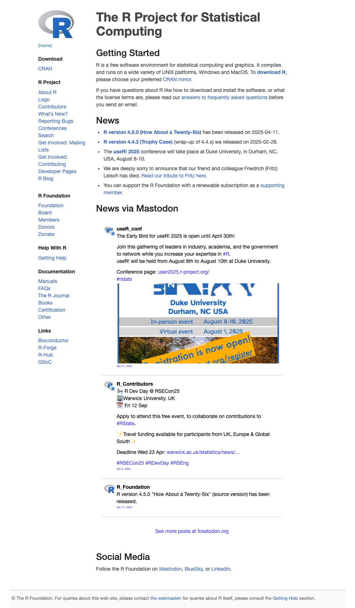
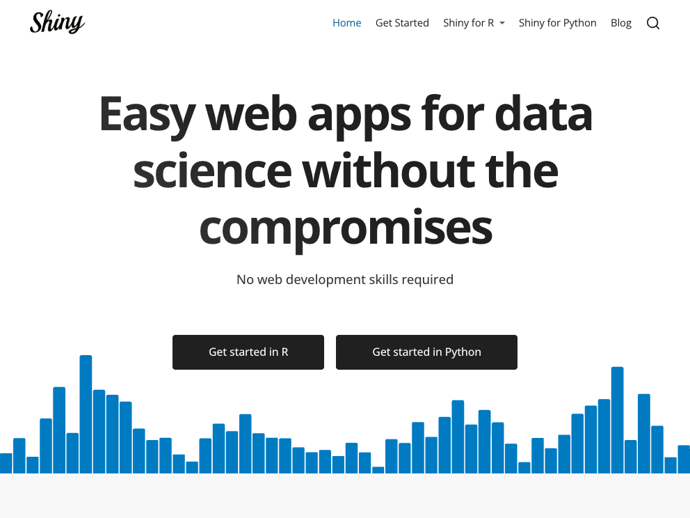
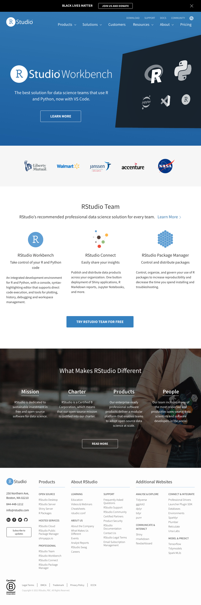
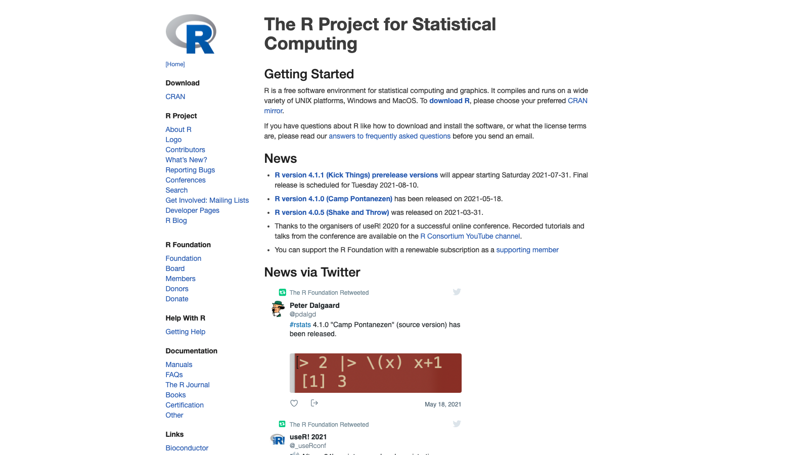

<!-- README.md is generated from README.Rmd. Please edit that file -->

```{r, include = FALSE}
knitr::opts_chunk$set(
  collapse = TRUE,
  comment = "#>",
  fig.path = "man/figures/README-",
  out.width = "100%"
)
```

# webshot2

<!-- badges: start -->
[](https://github.com/rstudio/webshot2/actions)
[](https://CRAN.R-project.org/package=webshot2)
[](https://www.r-pkg.org/pkg/webshot2)
[](https://forum.posit.co/new-topic?category=shiny&tags=webshot2)
<!-- badges: end -->

**webshot2** is meant to be a replacement for [webshot](https://wch.github.io/webshot/), except that instead of using PhantomJS, it uses headless Chrome via the [Chromote](https://github.com/rstudio/chromote) package.


## Installation

```R
# CRAN
install.packages("webshot2")

# Development
remotes::install_github("rstudio/webshot2")
```

You also need to have the Chrome browser installed on your system. You can also use other browsers based on Chromium, such as Chromium itself, Edge, Vivaldi, Brave, or Opera.


## Usage

``` r
library(webshot2)

# Single page
webshot("https://www.r-project.org")
```



``` r
# Multiple pages (in parallel!)
webshot(c("https://www.r-project.org", "https://www.rstudio.com"))
```



``` r
# Specific height and width
webshot("https://www.r-project.org", vwidth = 1600, vheight = 900, cliprect = "viewport")
```



```{r demo-eval, eval = FALSE, echo = FALSE}
# Run this code to update the images above
library(webshot2)

# Single page
webshot("https://www.r-project.org", "man/figures/README-demo-1.png")
# Multiple pages (in parallel!)
webshot(c("https://www.r-project.org", "https://www.rstudio.com"), c("man/figures/README-demo-2.png", "man/figures/README-demo-3.png"))
# Specific height and width
webshot("https://www.r-project.org", "man/figures/README-demo-4.png", vwidth = 1600, vheight = 900, cliprect = "viewport")
```
