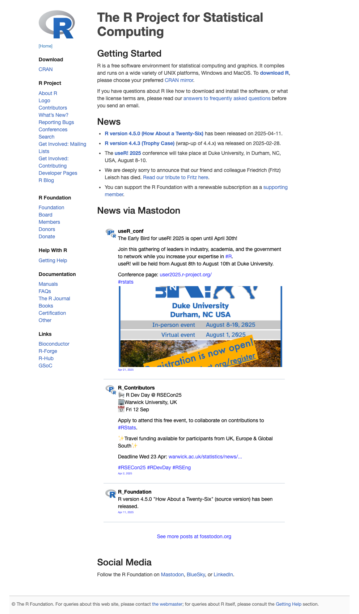
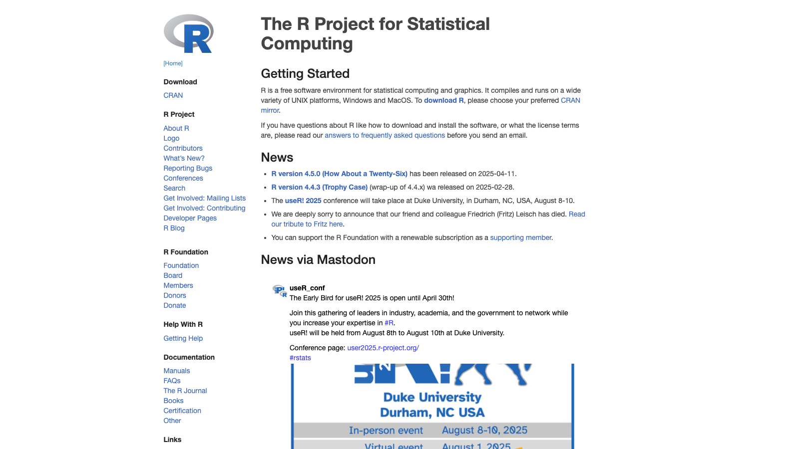

<!-- README.md is generated from README.Rmd. Please edit that file -->

# webshot2

<!-- badges: start -->

<!-- badges: end -->

**webshot2** is meant to be a replacement for
[webshot](https://wch.github.io/webshot/), except that instead of using
PhantomJS, it uses headless Chrome via the
[Chromote](https://github.com/rstudio/chromote) package.

## Installation

webshot2 currently depends on a number of in-development packages.

``` r
remotes::install_github("rstudio/webshot2")
```

You also need to have the Chrome browser installed on your system. You
can also use other browsers based on Chromium, such as Chromium itself,
Edge, Vivaldi, Brave, or Opera.

## Usage

``` r
library(webshot2)

# Single page
webshot("https://www.r-project.org")
```



``` r

# Multiple pages (in parallel!)
webshot(c("https://www.r-project.org", "https://www.rstudio.com"))
```



``` r

# Specific height and width
webshot("https://www.r-project.org", vwidth = 1600, vheight = 900, cliprect = "viewport")
```


